## Redis

下图出自[DB ENGINES官网](https://db-engines.com/en/)

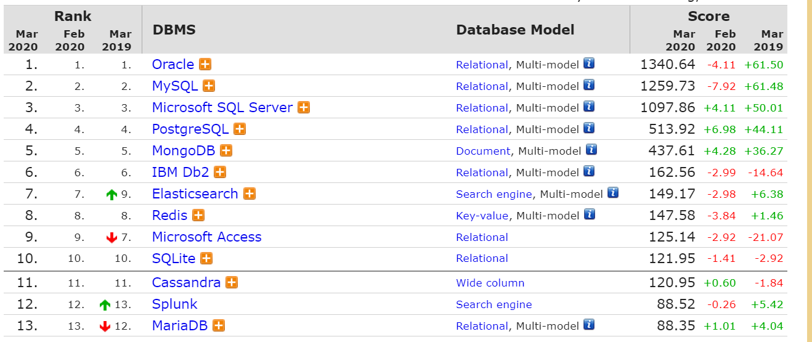

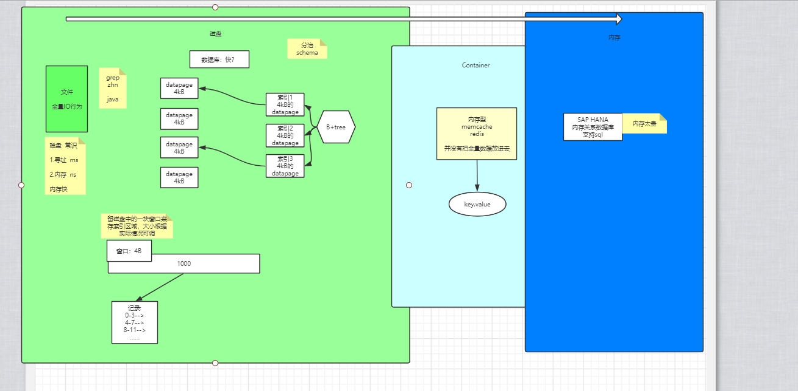

> Redis是什么，为什么要学习Redis，怎么使用Redis
>
> [面试Redis大全](https://www.yinxiang.com/everhub/note/ffb1a9d1-0246-45db-9324-644f364e681e)

**1.Redis的安装**

**2.Redis核心配置文件Redis.conf讲解文件**

**3.Docker安装Redis**

**4.Redis常用数据类型**

```
String Hash List Set Zset Hyper loglog
```

SpringBoot2.x中Redis进行连接（RedisTemplate[Lettuce]）

**5.其他功能**

Redis订阅发布
Redistribution事务=>商品秒杀应用场景进行案例展示

Redis数据淘汰策略

Redis持久化

Redis缓存与数据库（Mysql）同步

-->使用的是Kafka做异步队列

Redis知识总结：

缓存穿透、缓存雪崩、热点key等处理方案（会双重锁的使用）

**6.Redis高级配置**

Redis 5 版本集群创建

Java客户端 远程连接RedisCluster实战应用

SpringBoot2.x+RedisCluster整合操作

## 一、Redis简介

### 1.1简介

> REmote DIctionary Server(Redis) 是一个由Salvatore Sanfilippo写的key-value存储系统。是NoSQL型数据库。
>
> Redis是一个开源的使用ANSI C语言编写、遵守BSD协议、支持网络、可基于内存亦可持久化的日志型、Key-Value数据库，并提供多种语言的API。
>
> 它通常被称为数据结构服务器，因为值（value）可以是 字符串(String), 哈希(Hash), 列表(list), 集合(sets) 和 有序集合(sorted sets)等类型。

### 1.2NoSQL介绍

> NoSQL，指的是非关系型的数据库。NoSQL有时也称作Not Only SQL的缩写，是对不同于传统的关系型数据库的数据库管理系统的统称。
>
> NoSQL用于超大规模数据的存储。（例如谷歌或Facebook每天为他们的用户收集万亿比特的数据）。这些类型的数据存储不需要固定的模式，无需多余操作就可以横向扩展。
>
> 今天我们可以通过第三方平台（如：Google,Facebook等）可以很容易的访问和抓取数据。用户的个人信息，社交网络，地理位置，用户生成的数据和用户操作日志已经成倍的增加。我们如果要对这些用户数据进行挖掘，那SQL数据库已经不适合这些应用了, NoSQL数据库的发展也却能很好的处理这些**大的数据**。

#### 1.2.1NoSQL数据库的四大分类

- 键值(Key-Value)存储数据库

  > **key-value分布式存储系统**查询速度快、存放数据量大、支持高并发，非常适合通过主键进行查询，但不能进行复杂的条件查询。
  >
  > 如果辅以Real-Time Search Engine（实时搜索引擎）进行复杂条件检索、全文检索，就可以替代并发性能较低的MySQL等关系型数据库，达到高并发、高性能，节省几十倍服务器数 量的目的。以MemcacheDB、Tokyo Tyrant为代表的key-value分布式存储，在上万并发连接下，轻松地完成高速查询。而MySQL，在几百个并发连接下，就基本上崩溃了。
  >
  > key value 根据关键字取值
  >
  > key是关键字
  >
  > value是值
  >
  > 具有极高的并发读写性能
  >
  > Key-value数据库是一种以键值对存储数据的一种数据库，类似Java中的map。可以将整个数据库理解为一个**大的map**，每个键都会对应一个唯一的值

- 列存储数据库

  > 我们知道，在SQL Server里，Page是数据存储的基本单位，而数据行是实际数据的存储单位，它们从Page Header之后就开始依次存储在Page上。这种按行在Page上存储记录的方式就是行存储。当数据是按单列而不是多行进行连续存储时，就是所谓的列存储。
  >
  > [为什么列存储数据库比传统数据库快](https://www.zhihu.com/question/29380943)

- 文档型数据库

  > 该类型的数据模板是版本化的文档，半结构化的文档以特定的格式存储，比如JSON。可以看作是键值数据库的升级版，查询速度也比他快。比如CouchDB,MongDB。

- 图形数据库

  > Node4J

  

#### 1.2.2适用场景

  - 数据模型比较简单
  - 需要灵活性更强的IT系统
  - 对数据库性能要求较高
  - 不需要高度的数据一致性
  - 对于给定的key，比较容易映射复杂值的环境

  为什么比SQL快：

  因为SQL的执行过程是这样的：

  1.解析字符串 select * from users;

  2.将字符串转换成对象

  3.经过大量的算法进行查询操作

  4.展示到控制台上

  NoSQL涉及不到这些复杂的东西。

  

### 1.3特点

  - 性能高 —— Redis能读的速度是110000次/s，写的速度是81000次/s。
  - 丰富的数据类型 —— Redis支持的类型String，LIst，Hash，Set及Ordered Set数据类型操作。
  - 原子操作。单个操作是原子性的。多个操作也支持事务，即原子性，通过MULTI和EXEC指令包起来。
  - 丰富的特性 —— Redis还支持publish/subscribe，通知，key过期等等特性。
  - 简单是Redis突出的特性，保证了核心功能的稳定和优异。

### 1.4总结

- redis单个key存入512M大小
- 支持多种类型的数据结构
- 单线程 原子性
- 可以持久化 因为使用了RDB和AOF机制
- 支持集群 而且支持0-15个库
- 还可以做消息队列  比如聊天室 IM

企业级开发中：可以用作数据库、缓存（热点数据）和消息中间件等大部分功能

缺点：持久化时，写入磁盘可能因为文件太大而导致时间花费多。

## 二、Redis安装和启动

2.1windows[安装](https://www.runoob.com/redis/redis-install.html)


2.2Linux[安装](https://www.runoob.com/redis/redis-install.html)

①gcc 因为Redis是C写的，所以要安装gcc依赖环境

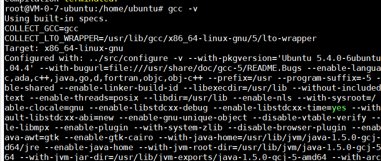

②安装redis

> ```livescript
> $ wget http://download.redis.io/releases/redis-****版本.tar.gz
> $ tar xzf redis-2.8.17.tar.gz
> $ cd redis-2.8.17
> $ make
> ```

wget下载

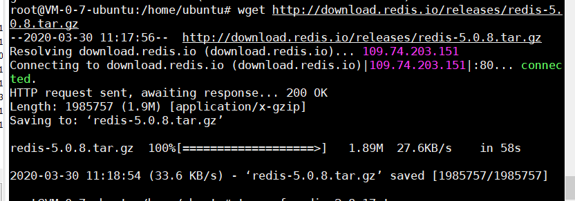

tar解压


make编译

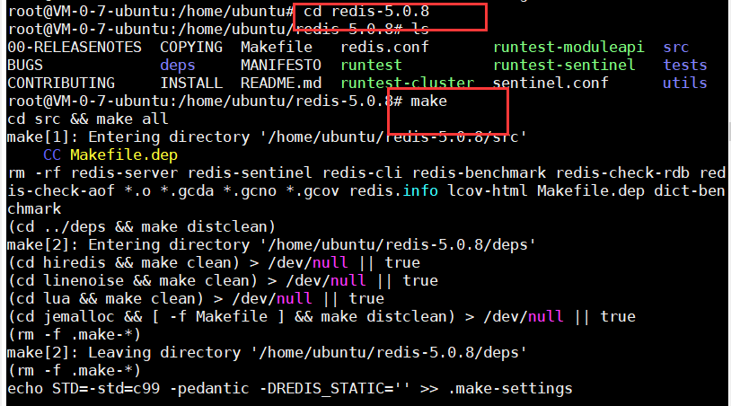

进入src，./redis-server启动redis服务

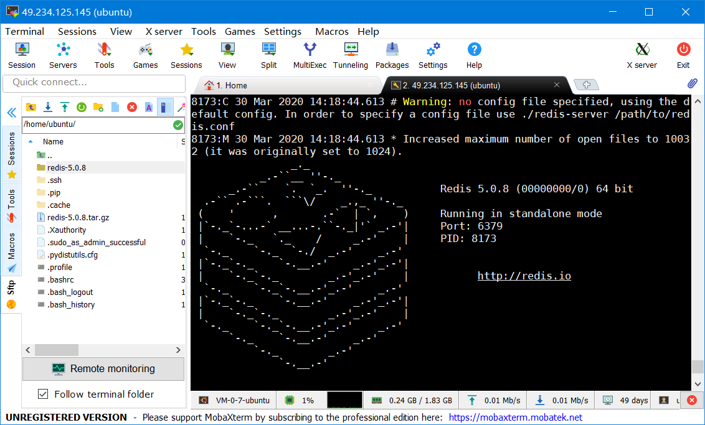

这时候这个窗口被占用了，重启一个窗口开启客户端 进入src 输入./redis-cli

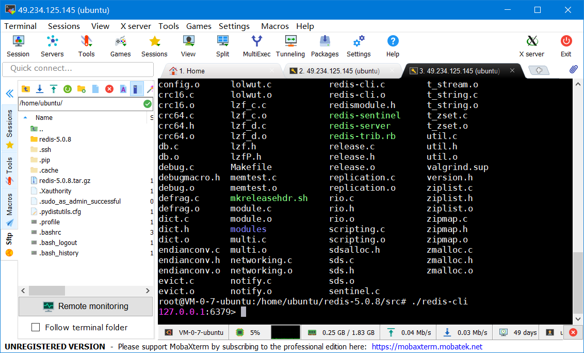

检测客户端是不是启动。

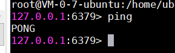
成功

## 三、Linux下配置Redis

Redis的配置文件位于Redis安装目录下，文件名为 redis.conf。（Windows名为redis.windows.conf）。

### 1.查看——conf文件中的配置型

| 序号 | 配置项                                                       | 说明                                                         |
| :--- | :----------------------------------------------------------- | :----------------------------------------------------------- |
| 1    | `daemonize no`                                               | Redis 默认不是以守护进程的方式运行，可以通过该配置项修改，使用 yes 启用守护进程（Windows 不支持守护线程的配置为 no ）**这里要改成yes** |
| 2    | `pidfile /var/run/redis.pid`                                 | 当 Redis 以守护进程方式运行时，Redis 默认会把 pid 写入 /var/run/redis.pid 文件，可以通过 pidfile 指定 |
| 3    | `port 6379`                                                  | 指定 Redis 监听端口，默认端口为 6379，作者在自己的一篇博文中解释了为什么选用 6379 作为默认端口，因为 6379 在手机按键上 MERZ 对应的号码，而 MERZ 取自意大利歌女 Alessia Merz 的名字 |
| 4    | `bind 127.0.0.1`                                             | 绑定的主机地址<br />**要改这里，注释掉**                     |
| 5    | `timeout 300`                                                | 当客户端闲置多长时间后关闭连接，如果指定为 0，表示关闭该功能 |
| 6    | `loglevel notice`                                            | 指定日志记录级别，Redis 总共支持四个级别：debug、verbose、notice、warning，默认为 notice |
| 7    | `logfile stdout`                                             | 日志记录方式，默认为标准输出，如果配置 Redis 为守护进程方式运行，而这里又配置为日志记录方式为标准输出，则日志将会发送给 /dev/null |
| 8    | `databases 16`                                               | 设置数据库的数量，默认数据库为0，可以使用SELECT 命令在连接上指定数据库id |
| 9    | `save  `Redis 默认配置文件中提供了三个条件：save 900 1 save 300 10 save 60 10000分别表示 900 秒（15 分钟）内有 1 个更改，300 秒（5 分钟）内有 10 个更改以及 60 秒内有 10000 个更改。 | 指定在多长时间内，有多少次更新操作，就将数据同步到数据文件，可以多个条件配合<br />**持久化操作的条件** |
| 10   | `rdbcompression yes`                                         | 指定存储至本地数据库时是否压缩数据，默认为 yes，Redis 采用 LZF 压缩，如果为了节省 CPU 时间，可以关闭该选项，但会导致数据库文件变的巨大 |
| 11   | `dbfilename dump.rdb`                                        | 指定本地数据库文件名，默认值为 dump.rdb                      |
| 12   | `dir ./`                                                     | 指定本地数据库存放目录——**指redis安装后的目录**              |
| 13   | `slaveof  `                                                  | 设置当本机为 slav 服务时，设置 master 服务的 IP 地址及端口，在 Redis 启动时，它会自动从 master 进行数据同步 |
| 14   | `masterauth `                                                | 当 master 服务设置了密码保护时，slav 服务连接 master 的密码  |
| 15   | `requirepass foobared`                                       | 设置 Redis 连接密码，如果配置了连接密码，客户端在连接 Redis 时需要通过 AUTH <password> 命令提供密码，默认关闭 |
| 16   | ` maxclients 128`                                            | 设置同一时间最大客户端连接数，默认无限制，Redis 可以同时打开的客户端连接数为 Redis 进程可以打开的最大文件描述符数，如果设置 maxclients 0，表示不作限制。当客户端连接数到达限制时，Redis 会关闭新的连接并向客户端返回 max number of clients reached 错误信息 |
| 17   | `maxmemory `                                                 | 指定 Redis 最大内存限制，Redis 在启动时会把数据加载到内存中，达到最大内存后，Redis 会先尝试清除已到期或即将到期的 Key，当此方法处理 后，仍然到达最大内存设置，将无法再进行写入操作，但仍然可以进行读取操作。Redis 新的 vm 机制，会把 Key 存放内存，Value 会存放在 swap 区 **建议：考虑服务器的内存** |
| 18   | `appendonly no`                                              | 指定是否在每次更新操作后进行日志记录，Redis 在默认情况下是异步的把数据写入磁盘，如果不开启，可能会在断电时导致一段时间内的数据丢失。因为 redis 本身同步数据文件是按上面 save 条件来同步的，所以有的数据会在一段时间内只存在于内存中。默认为 no |
| 19   | `appendfilename appendonly.aof`                              | 指定更新日志文件名，默认为 appendonly.aof                    |
| 20   | `appendfsync everysec`                                       | 指定更新日志条件，共有 3 个可选值：**no**：表示等操作系统进行数据缓存同步到磁盘（快）**always**：表示每次更新操作后手动调用 fsync() 将数据写到磁盘（慢，安全）**everysec**：表示每秒同步一次（折中，默认值） |
| 21   | `vm-enabled no`                                              | 指定是否启用虚拟内存机制，默认值为 no，简单的介绍一下，VM 机制将数据分页存放，由 Redis 将访问量较少的页即冷数据 swap 到磁盘上，访问多的页面由磁盘自动换出到内存中（在后面的文章我会仔细分析 Redis 的 VM 机制） |
| 22   | `vm-swap-file /tmp/redis.swap`                               | 虚拟内存文件路径，默认值为 /tmp/redis.swap，不可多个 Redis 实例共享 |
| 23   | `vm-max-memory 0`                                            | 将所有大于 vm-max-memory 的数据存入虚拟内存，无论 vm-max-memory 设置多小，所有索引数据都是内存存储的(Redis 的索引数据 就是 keys)，也就是说，当 vm-max-memory 设置为 0 的时候，其实是所有 value 都存在于磁盘。默认值为 0 |
| 24   | `vm-page-size 32`                                            | Redis swap 文件分成了很多的 page，一个对象可以保存在多个 page 上面，但一个 page 上不能被多个对象共享，vm-page-size 是要根据存储的 数据大小来设定的，作者建议如果存储很多小对象，page 大小最好设置为 32 或者 64bytes；如果存储很大大对象，则可以使用更大的 page，如果不确定，就使用默认值 |
| 25   | `vm-pages 134217728`                                         | 设置 swap 文件中的 page 数量，由于页表（一种表示页面空闲或使用的 bitmap）是在放在内存中的，，在磁盘上每 8 个 pages 将消耗 1byte 的内存。 |
| 26   | `vm-max-threads 4`                                           | 设置访问swap文件的线程数,最好不要超过机器的核数,如果设置为0,那么所有对swap文件的操作都是串行的，可能会造成比较长时间的延迟。默认值为4 |
| 27   | `glueoutputbuf yes`                                          | 设置在向客户端应答时，是否把较小的包合并为一个包发送，默认为开启 |
| 28   | `hash-max-zipmap-entries 64 hash-max-zipmap-value 512`       | 指定在超过一定的数量或者最大的元素超过某一临界值时，采用一种特殊的哈希算法 |
| 29   | `activerehashing yes`                                        | 指定是否激活重置哈希，默认为开启（后面在介绍 Redis 的哈希算法时具体介绍） |
| 30   | `include /path/to/local.conf`                                | 指定包含其它的配置文件，可以在同一主机上多个Redis实例之间使用同一份配置文件，而同时各个实例又拥有自己的特定配置文件 |

### 2.LRU算法

redis作为优秀的中间缓存件，时常会存储大量的数据，即使采取了集群部署来动态扩容，也应该即时地整理内存，维持系统性能（如果数据一直新增，额你存很快就会被占满）。

一是为数据设置超时时间

二是采用LRU算法动态将不用的数据删除
一共有八个，最常用的有六个

volatile-lru -> Evict using approximated LRU among the keys with an expire set.
设定超时时间的数据中，删除最不常用的数据。

allkeys-lru -> Evict any key using approximated LRU.
查询所有的key中最近最不常用的数据进行删除，这是最广泛的策略。

volatile-lfu -> Evict using approximated LFU among the keys with an expire set.

allkeys-lfu -> Evict any key using approximated LFU.

volatile-random -> Remove a random key among the ones with an expire set.

在已经设定了超时的数据中随机删除。

allkeys-random -> Remove a random key, any key.

查询所有的key之后随机删除

volatile-ttl -> Remove the key with the nearest expire time (minor TTL)

noeviction -> Don't evict anything, just return an error on write operations.
默认  不设置

### 3.Redis配置默认要进行修改

- daemonize no 修改为yes
- bind 127.0.0.1 注释掉
- requirepass 设置密码（备注密码：zhn）

## 四、绑定conf启动redis服务与客户端

./redis-server ./redis.cong   这俩个要同目录，所有要把conf放到src下——cp redis.conf src

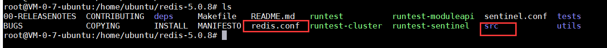

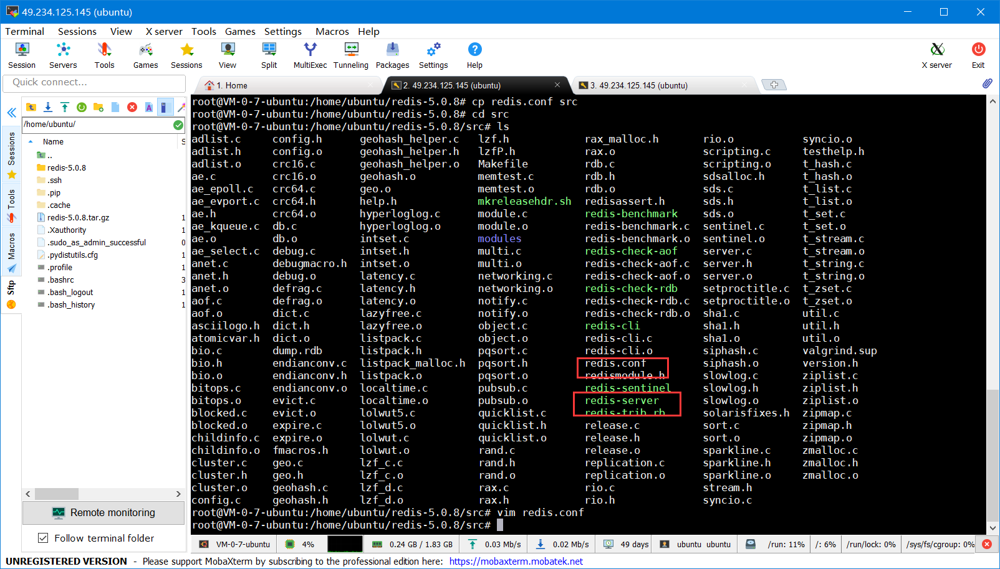

可以绑定conf文件来开启server了——已经开启守护进程了 不用再开新窗口了

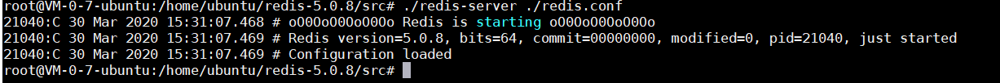

查看redis进程

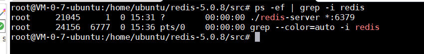

开启客户端——需要加密码了，语法：

```
redis-cli -h IP地址 -p 端口 -a 密码
```

ip，端口可以默认本机，6379不写


keys * 表示一个查询key的操作，表示连接上了，只不过现在是空的而已

加一个key

```
set gradeName java11
```

## 五、Redis的关闭

第一种：直接断电、kill进程、非正常关闭

查询PID ps -ef | grep -i redis    kill-9 PID

第二种：正常关闭、数据保存
客户端中关闭：./redis-cli 中 shutdown

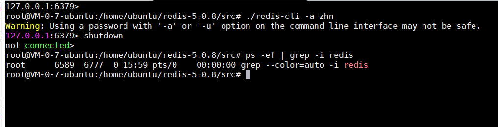

## 六、Redis常用命令

### 1.Redis键key的描述

Redis键命令用于管理Redis的键

| 序号 | 命令及描述                                                   |
| :--- | :----------------------------------------------------------- |
| 1    | [DEL key](https://www.runoob.com/redis/keys-del.html) 该命令用于在 key 存在时删除 key。 |
| 2    | [DUMP key](https://www.runoob.com/redis/keys-dump.html)  序列化给定 key ，并返回被序列化的值。——写入磁盘时要用这个序列号 |
| 3    | [EXISTS key](https://www.runoob.com/redis/keys-exists.html)  检查给定 key 是否存在。 |
| 4    | [EXPIRE key](https://www.runoob.com/redis/keys-expire.html) seconds 为给定 key 设置过期时间，以秒计。 |
| 5    | [EXPIREAT key timestamp](https://www.runoob.com/redis/keys-expireat.html)  EXPIREAT 的作用和 EXPIRE 类似，都用于为 key 设置过期时间。 不同在于 EXPIREAT 命令接受的时间参数是 UNIX 时间戳(unix timestamp)。 |
| 6    | [PEXPIRE key milliseconds](https://www.runoob.com/redis/keys-pexpire.html)  设置 key 的过期时间以毫秒计。 |
| 7    | [PEXPIREAT key milliseconds-timestamp](https://www.runoob.com/redis/keys-pexpireat.html)  设置 key 过期时间的时间戳(unix timestamp) 以毫秒计 |
| 8    | [KEYS pattern](https://www.runoob.com/redis/keys-keys.html)  查找所有符合给定模式( pattern)的 key 。 |
| 9    | [MOVE key db](https://www.runoob.com/redis/keys-move.html)  将当前数据库的 key 移动到给定的数据库 db 当中。 |
| 10   | [PERSIST key](https://www.runoob.com/redis/keys-persist.html)  移除 key 的过期时间，key 将持久保持。 |
| 11   | [PTTL key](https://www.runoob.com/redis/keys-pttl.html)  以毫秒为单位返回 key 的剩余的过期时间。 |
| 12   | [TTL key](https://www.runoob.com/redis/keys-ttl.html)  以秒为单位，返回给定 key 的剩余生存时间(TTL, time to live)。 |
| 13   | [RANDOMKEY](https://www.runoob.com/redis/keys-randomkey.html)  从当前数据库中随机返回一个 key 。 |
| 14   | [RENAME key newkey](https://www.runoob.com/redis/keys-rename.html)  修改 key 的名称 |
| 15   | [RENAMENX key newkey](https://www.runoob.com/redis/keys-renamenx.html)  仅当 newkey 不存在时，将 key 改名为 newkey 。 |
| 16   | [TYPE key](https://www.runoob.com/redis/keys-type.html)  返回 key 所储存的值的类型。 |

[命令大全](https://redis.io/commands)


这个蛮有意思，设置key的过期时间——LRU算法
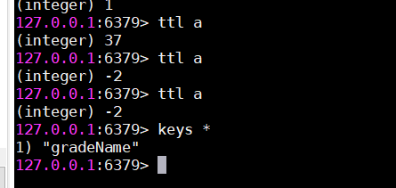

过了四十秒以后就在内存中消失了，现在慢慢对Redis缓存这个概念有感觉了。


通配符的使用也挺有意思，所以命名一定要规范，方便查询


### 2.应用场景

Expire key second

> 限时的优惠活动信息
>
> 定时更新的排行榜
>
> 手机验证码
>
> 限制网站访客访问频率

### 3.key的命名建议

要知道NoSQL的数据之间是没有关系的，但如果要涉及关系了，可以用命名来表示一定的关系。

key的名字不能太长也不能太短，在一个项目中命名也要用统一的命名格式。
users:1:name 赵浩男
users:2:name 麻新钰

## 七、Redis的数据类型

> Redis 支持五种数据类型：String、Hash、List、Set、zSet（有序集合）

#### 索引

> 马士兵的redis课程

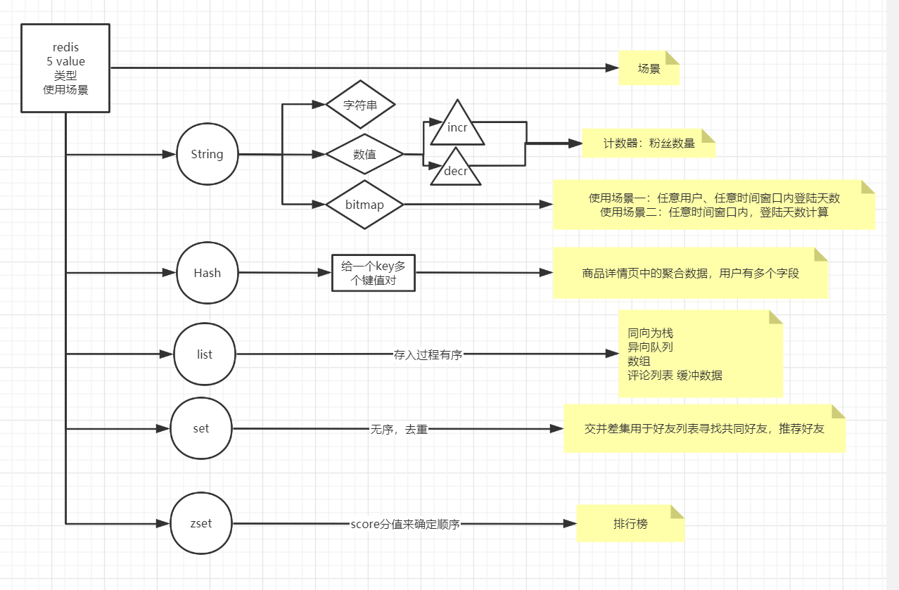


### Ⅰ.String

#### 1.String介绍

- 一个键能存储512MB数据，一个key对应一个value
- string类型是二进制安全的，可以存储任何数据，比如jpg图片或序列化对象
> 二进制安全是指，在传输数据时，保证二进制数据的信息安全，也就是不被篡改、破译等，如果被攻击，能够及时检测出来。
>
> 二进制安全特点：①编码、解码都在客户端完成，执行效率高②不需要频繁的编解码，不会出现乱码

看下面的，中文变成一个序列。当然这是因为客户端的问题，get出来不是中文，这个客户端不具备解码功能。

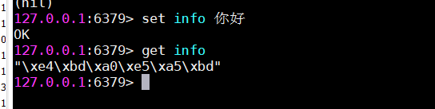

#### 2.String命令

| 1    | [SET key value](https://www.runoob.com/redis/strings-set.html)  设置指定 key 的值(如果已有该值  会覆盖该值) |
| ---- | ------------------------------------------------------------ |
| 2    | [GET key](https://www.runoob.com/redis/strings-get.html)  获取指定 key 的值。 |
| 3    | [GETRANGE key start end](https://www.runoob.com/redis/strings-getrange.html)  返回 key 中字符串值的子字符（和java中的substring很像） |
| 4    | [GETSET key value](https://www.runoob.com/redis/strings-getset.html) 将给定 key 的值设为 value ，并返回 key 的旧值(old value)。 |
| 5    | [GETBIT key offset](https://www.runoob.com/redis/strings-getbit.html) 对 key 所储存的字符串值，获取指定偏移量上的位(bit)。 |
| 6    | [MGET key1 [key2..\]](https://www.runoob.com/redis/strings-mget.html) 获取所有(一个或多个)给定 key 的值。 |
| 7    | [SETBIT key offset value](https://www.runoob.com/redis/strings-setbit.html) 对 key 所储存的字符串值，设置或清除指定偏移量上的位(bit)。 |
| 8    | [SETEX key seconds value](https://www.runoob.com/redis/strings-setex.html) 将值 value 关联到 key ，并将 key 的过期时间设为 seconds (以秒为单位)。 |
| 9    | [SETNX key value](https://www.runoob.com/redis/strings-setnx.html) 只有在 key 不存在时设置 key 的值。**（如果存在就失效了）** |
| 10   | [SETRANGE key offset value](https://www.runoob.com/redis/strings-setrange.html) 用 value 参数覆写给定 key 所储存的字符串值，从偏移量 offset 开始。 |
| 11   | [STRLEN key](https://www.runoob.com/redis/strings-strlen.html) 返回 key 所储存的字符串值的长度。 |
| 12   | [MSET key value [key value ...\]](https://www.runoob.com/redis/strings-mset.html) 同时设置一个或多个 key-value 对。 |
| 13   | [MSETNX key value [key value ...\]](https://www.runoob.com/redis/strings-msetnx.html)  同时设置一个或多个 key-value 对，当且仅当所有给定 key 都不存在。 |
| 14   | [PSETEX key milliseconds value](https://www.runoob.com/redis/strings-psetex.html) 这个命令和 SETEX 命令相似，但它以毫秒为单位设置 key 的生存时间，而不是像 SETEX 命令那样，以秒为单位。 |
| 15   | [INCR key](https://www.runoob.com/redis/strings-incr.html) 将 key 中储存的数字值增一。**（没有key时，可以用这条命令初始化为0）** |
| 16   | [INCRBY key increment](https://www.runoob.com/redis/strings-incrby.html) 将 key 所储存的值加上给定的增量值（increment） 。 |
| 17   | [INCRBYFLOAT key increment](https://www.runoob.com/redis/strings-incrbyfloat.html) 将 key 所储存的值加上给定的浮点增量值（increment） 。 |
| 18   | [DECR key](https://www.runoob.com/redis/strings-decr.html) 将 key 中储存的数字值减一。 |
| 19   | [DECRBY key decrement](https://www.runoob.com/redis/strings-decrby.html) key 所储存的值减去给定的减量值（decrement） 。 |
| 20   | [APPEND key value](https://www.runoob.com/redis/strings-append.html) 如果 key 已经存在并且是一个字符串， APPEND 命令将指定的 value 追加到该 key 原来值（value）的末尾。 |

#### 3.bitmap讲解

> 马士兵讲的  作为补充

```shell
127.0.0.1:6379> FLUSHALL    //清空数据库
127.0.0.1:6379> SETBIT k1 1 1  //0000000 偏移量为1的位置 置为1--> 01000000
127.0.0.1:6379> get k1
"@"                            //十进制为64 对用ASCII中的@符号
127.0.0.1:6379> SETBIT k1 7 1  //第七位也设置为1后  这个value变成了A 对应十进制64

127.0.0.1:6379> SETBIT k1 33 1 //偏移大于七位时  自动扩展但还是八个二进制数为一个单位
*** 00000000 00000000 00000000……***
127.0.0.1:6379> get k1
"A\x00\x00\x00@"

***************支持 and or 的二进制操作******************
*****k1是 01000001 k2是 01000000******
127.0.0.1:6379> BITOP and andkey k1 k2
(integer) 1
127.0.0.1:6379> keys *
1) "andkey"
2) "k2"
3) "k1"
127.0.0.1:6379> get andkey
"@"

127.0.0.1:6379> BITOP or orkey k1 k2
(integer) 1
127.0.0.1:6379> get orkey
"A"
127.0.0.1:6379>

*********计算二进制中的1的个数********
127.0.0.1:6379> BITCOUNT andkey
(integer) 1
127.0.0.1:6379> BITCOUNT orkey
(integer) 2
还可以加参数  start - end 其中end为-1时,是全部位置(支持反向)
```


#### 4.使用场景

①String通常用于保存单个字符串或者JSON字符串数据

②图片作为字符串来存储

③计数器（常规key-value缓存应用。常规计数：微博数，粉丝数）且增加减少的指令具有原子性，因此很多网站都用redis的这个特性来实现业务上的统计计数的需求。

**④用bitmap完成两个场景：**

使用场景一：任意用户、一年内任意时间窗口内登陆天数

```sh
127.0.0.1:6379> SETBIT hn 2 1
127.0.0.1:6379> SETBIT hn 364 1
127.0.0.1:6379> BITCOUNT hn
(integer) 2

一年有365天 hn用户  在第三天（偏移量为2）的位置标记为1，在第365天的位置标记为1
这样就能用BITCOUNT计算一年内登陆的天数
```

使用场景二：任意时间窗口内，登陆天数标记,计算输出在这个窗口时间内凡是登陆过的人的个数

```shell
127.0.0.1:6379> SETBIT 20200101 3 1
(integer) 0
127.0.0.1:6379> SETBIT 20200102 8 1
(integer) 0
127.0.0.1:6379> BITOP or res 20200101 20200102
(integer) 2
127.0.0.1:6379> BITCOUNT res
(integer) 2
127.0.0.1:6379>

表示一月一号  第四个用户登陆了,一月二号  第九个用户登陆了  一共登陆了2个
```

### Ⅱ.Hash

> RedistHash是一个string类型的哈希，适用于给一个对象赋值。如user(id,name,age)

#### 1.Hash命令


| 1    | [HDEL key field1 [field2\]](https://www.runoob.com/redis/hashes-hdel.html)  删除一个或多个哈希表字段 |
| ---- | ------------------------------------------------------------ |
| 2    | [HEXISTS key field](https://www.runoob.com/redis/hashes-hexists.html)  查看哈希表 key 中，指定的字段是否存在。 |
| 3    | [HGET key field](https://www.runoob.com/redis/hashes-hget.html)  获取存储在哈希表中指定字段的值。 |
| 4    | [HGETALL key](https://www.runoob.com/redis/hashes-hgetall.html)  获取在哈希表中指定 key 的**所有字段和值** |
| 5    | [HINCRBY key field increment](https://www.runoob.com/redis/hashes-hincrby.html)  为哈希表 key 中的指定字段的整数值加上增量 increment 。 |
| 6    | [HINCRBYFLOAT key field increment](https://www.runoob.com/redis/hashes-hincrbyfloat.html)  为哈希表 key 中的指定字段的浮点数值加上增量 increment 。 |
| 7    | [HKEYS key](https://www.runoob.com/redis/hashes-hkeys.html)  获取**所有**哈希表中的**字段** |
| 8    | [HLEN key](https://www.runoob.com/redis/hashes-hlen.html)  获取哈希表中字段的数量 |
| 9    | [HMGET key field1 [field2\]](https://www.runoob.com/redis/hashes-hmget.html)  获取所有给定字段的值 |
| 10   | [HMSET key field1 value1 [field2 value2 \]](https://www.runoob.com/redis/hashes-hmset.html)  同时将**多个** field-value (域-值)对设置到哈希表 key 中。 |
| 11   | [HSET key field value](https://www.runoob.com/redis/hashes-hset.html)  **将哈希表 key 中的字段 field 的值设为 value 。**——**单个字段存值** |
| 12   | [HSETNX key field value](https://www.runoob.com/redis/hashes-hsetnx.html)  只有在字段 field 不存在时，设置哈希表字段的值。 |
| 13   | [HVALS key](https://www.runoob.com/redis/hashes-hvals.html)  获取哈希表中所有值 |
| 14   | HSCAN key cursor [MATCH pattern] [COUNT count]  迭代哈希表中的键值对。 |

这个类型不能直接覆盖。

h表示哈希，对哈希的数据类型的操作。hdel删除一个对象中的一个字段。

#### 2.适用场景

一个多字段的对象。就是因为String不适合作为一个对象的存储单位，所以引入了哈希类型。

注：没有值的key会被redis自动清楚，避免浪费内存。

### Ⅲ.List

> 像Java中的LinkedList类型

Redis列表是简单的字符串列表，按照插入顺序排序。你可以添加一个元素到列表的头部（左边）或者尾部（右边）

一个列表最多可以包含 232 - 1 个元素 (4294967295, 每个列表超过40亿个元素)。

#### 1.List命令

| 序号 | 命令及描述                                                   |
| :--- | :----------------------------------------------------------- |
| 1    | [BLPOP key1 [key2 \] timeout](https://www.runoob.com/redis/lists-blpop.html)  移出并获取列表的第一个元素， 如果列表没有元素会阻塞列表直到等待超时或发现可弹出元素为止。 |
| 2    | [BRPOP key1 [key2 \] timeout](https://www.runoob.com/redis/lists-brpop.html)  移出并获取列表的最后一个元素， 如果列表没有元素会阻塞列表直到等待超时或发现可弹出元素为止。 |
| 3    | [BRPOPLPUSH source destination timeout](https://www.runoob.com/redis/lists-brpoplpush.html)  从列表中弹出一个值，将弹出的元素插入到另外一个列表中并返回它； 如果列表没有元素会阻塞列表直到等待超时或发现可弹出元素为止。 |
| 4    | [LINDEX key index](https://www.runoob.com/redis/lists-lindex.html)  通过索引获取列表中的元素 |
| 5    | [LINSERT key BEFORE\|AFTER pivot value](https://www.runoob.com/redis/lists-linsert.html)  在列表的元素前或者后插入元素 |
| 6    | [LLEN key](https://www.runoob.com/redis/lists-llen.html)  获取列表长度 |
| 7    | [LPOP key](https://www.runoob.com/redis/lists-lpop.html)  移出并获取列表的第一个元素 |
| 8    | [LPUSH key value1 [value2\]](https://www.runoob.com/redis/lists-lpush.html)  将一个或多个值插入到列表头部——**有点像栈**  对应rpush |
| 9    | [LPUSHX key value](https://www.runoob.com/redis/lists-lpushx.html)  将一个值插入到已存在的列表头部 |
| 10   | [LRANGE key start stop](https://www.runoob.com/redis/lists-lrange.html)  获取列表指定范围内的元素  例如 lrang key 0 -1 |
| 11   | [LREM key count value](https://www.runoob.com/redis/lists-lrem.html)  移除列表元素 |
| 12   | [LSET key index value](https://www.runoob.com/redis/lists-lset.html)  通过索引设置列表元素的值 |
| 13   | [LTRIM key start stop](https://www.runoob.com/redis/lists-ltrim.html)  对一个列表进行修剪(trim)，就是说，让列表只保留指定区间内的元素，不在指定区间之内的元素都将被删除。 |
| 14   | [RPOP key](https://www.runoob.com/redis/lists-rpop.html)  移除列表的最后一个元素，返回值为移除的元素。 |
| 15   | [RPOPLPUSH source destination](https://www.runoob.com/redis/lists-rpoplpush.html)  移除列表的最后一个元素，并将该元素添加到另一个列表并返回 |
| 16   | [RPUSH key value1 [value2\]](https://www.runoob.com/redis/lists-rpush.html)  在列表中添加一个或多个值 ——对应lpush |
| 17   | [RPUSHX key value](https://www.runoob.com/redis/lists-rpushx.html)  为已存在的列表添加值 |

Redis Lrange 返回列表中指定区间内的元素，区间以偏移量 START 和 END 指定。 其中 0 表示列表的第一个元素， 1 表示列表的第二个元素，以此类推。 你也可以使用负数下标，以 -1 表示列表的最后一个元素， -2 表示列表的倒数第二个元素，以此类推。

### Ⅳ.Set

> Redis 的 Set 是 String 类型的无序集合。集合成员是唯一的，这就意味着集合中不能出现重复的数据。
>
> Redis 中集合是通过哈希表实现的，所以添加，删除，查找的复杂度都是 O(1)。
>
> 集合中最大的成员数为 232 - 1 (4294967295, 每个集合可存储40多亿个成员)。

### 1.set命令

| 序号 | 命令及描述                                                   |
| :--- | :----------------------------------------------------------- |
| 1    | [SADD key member1 [member2]](https://www.runoob.com/redis/sets-sadd.html)  向集合添加一个或多个成员 |
| 2    | [SCARD key](https://www.runoob.com/redis/sets-scard.html)  获取集合的成员数——**长度** |
| 3    | [SDIFF key1 [key2]](https://www.runoob.com/redis/sets-sdiff.html)  返回给定所有集合的差集 |
| 4    | [SDIFFSTORE destination key1 [key2]](https://www.runoob.com/redis/sets-sdiffstore.html)  返回给定所有集合的差集并存储在 destination 中 |
| 5    | [SINTER key1 [key2]](https://www.runoob.com/redis/sets-sinter.html)  返回给定所有集合的交集 |
| 6    | [SINTERSTORE destination key1 [key2]](https://www.runoob.com/redis/sets-sinterstore.html)  返回给定所有集合的交集并存储在 destination 中 |
| 7    | [SISMEMBER key member](https://www.runoob.com/redis/sets-sismember.html)  判断 member 元素是否是集合 key 的成员 |
| 8    | [SMEMBERS key](https://www.runoob.com/redis/sets-smembers.html)  返回集合中的**所有成员** |
| 9    | [SMOVE source destination member](https://www.runoob.com/redis/sets-smove.html)  将 member 元素从 source 集合移动到 destination 集合 **厉害了** |
| 10   | [SPOP key](https://www.runoob.com/redis/sets-spop.html)  移除并返回集合中的一个随机元素 |
| 11   | [SRANDMEMBER key [count]](https://www.runoob.com/redis/sets-srandmember.html)  返回集合中一个或多个随机数 |
| 12   | [SREM key member1 [member2]](https://www.runoob.com/redis/sets-srem.html)  移除集合中一个或多个成员 |
| 13   | [SUNION key1 [key2]](https://www.runoob.com/redis/sets-sunion.html)  返回所有给定集合的并集 |
| 14   | [SUNIONSTORE destination key1 [key2]](https://www.runoob.com/redis/sets-sunionstore.html)  所有给定集合的并集存储在 destination 集合中 |
| 15   | [SSCAN key cursor [MATCH pattern] [COUNT count]](https://www.runoob.com/redis/sets-sscan.html)  迭代集合中的元素 |

几个有趣的命令

```shell
127.0.0.1:6379> sadd s1 1 2 3 a b c
(integer) 6
127.0.0.1:6379> sadd s2 4 5 6 e f g c
(integer) 6
127.0.0.1:6379> SDIFF s1 s2
1) "2"
2) "a"
3) "1"
4) "3"
5) "b"
```

差集 ：看s1中的哪些元素是s2中没有的元素

还有交集SINTER  和  并集SUNION

Store功能还能存储这些结果。

### 2.应用场景

- 抽奖功能

```shell
127.0.0.1:6379> SRANDMEMBER rset
"4"
```

随机选取集合中的一个用户。

- 验证用户是否存在

```shell
127.0.0.1:6379> SISMEMBER rset 3
(integer) 1
```

### Ⅴ.Zset类型

> 很多时候我们都将redis中的有序集合叫做zset，这是因为在redis中，有序集合相关的操作指令都是以z开头的。
>
> Redis 有序集合和集合一样也是string类型元素的集合,且不允许重复的成员。
>
> 不同的是**每个元素都会关联一个double类型的分数**。redis正是通过分数来为集合中的成员进行从小到大的排序。
>
> 有序集合的成员是唯一的,但分数(score)却可以重复。
>
> 集合是通过哈希表实现的，所以添加，删除，查找的复杂度都是O(1)。 集合中最大的成员数为 232 - 1 (4294967295, 每个集合可存储40多亿个成员)。

#### 1.Zset命令

| 序号 | 命令及描述                                                   |
| :--- | :----------------------------------------------------------- |
| 1    | [ZADD key score1 member1 [score2 member2]](https://www.runoob.com/redis/sorted-sets-zadd.html)  向有序集合添加一个或多个成员，或者更新已存在成员的分数 |
| 2    | [ZCARD key](https://www.runoob.com/redis/sorted-sets-zcard.html)  获取有序集合的**成员数** |
| 3    | [ZCOUNT key min max](https://www.runoob.com/redis/sorted-sets-zcount.html)  计算在有序集合中指定区间分数的成员数 |
| 4    | [ZINCRBY key increment member](https://www.runoob.com/redis/sorted-sets-zincrby.html)  有序集合中对指定成员的分数加上增量 increment |
| 5    | [ZINTERSTORE destination numkeys key [key ...]](https://www.runoob.com/redis/sorted-sets-zinterstore.html)  计算给定的一个或多个有序集的交集并将结果集存储在新的有序集合 key 中 |
| 6    | [ZLEXCOUNT key min max](https://www.runoob.com/redis/sorted-sets-zlexcount.html)  在有序集合中计算**指定字典区间内成员数量** |
| 7    | [ZRANGE key start stop [WITHSCORES]](https://www.runoob.com/redis/sorted-sets-zrange.html)  通过索引区间返回有序集合指定区间内的成员 |
| 8    | [ZRANGEBYLEX key min max [LIMIT offset count]](https://www.runoob.com/redis/sorted-sets-zrangebylex.html)  通过字典区间返回有序集合的成员 |
| 9    | [ZRANGEBYSCORE key min max [WITHSCORES\] [LIMIT]](https://www.runoob.com/redis/sorted-sets-zrangebyscore.html)  通过分数返回有序集合指定区间内的成员 |
| 10   | [ZRANK key member](https://www.runoob.com/redis/sorted-sets-zrank.html)  返回有序集合中指定成员的索引 |
| 11   | [ZREM key member [member ...]](https://www.runoob.com/redis/sorted-sets-zrem.html)  移除有序集合中的一个或多个成员 |
| 12   | [ZREMRANGEBYLEX key min max](https://www.runoob.com/redis/sorted-sets-zremrangebylex.html)  移除有序集合中给定的字典区间的所有成员 |
| 13   | [ZREMRANGEBYRANK key start stop](https://www.runoob.com/redis/sorted-sets-zremrangebyrank.html)  移除有序集合中给定的排名区间的所有成员 |
| 14   | [ZREMRANGEBYSCORE key min max](https://www.runoob.com/redis/sorted-sets-zremrangebyscore.html)  移除有序集合中给定的分数区间的所有成员 |
| 15   | [ZREVRANGE key start stop [WITHSCORES]](https://www.runoob.com/redis/sorted-sets-zrevrange.html)  返回有序集中指定区间内的成员，通过索引，分数从高到低 |
| 16   | [ZREVRANGEBYSCORE key max min [WITHSCORES]](https://www.runoob.com/redis/sorted-sets-zrevrangebyscore.html)  返回有序集中指定分数区间内的成员，分数从高到低排序 |
| 17   | [ZREVRANK key member](https://www.runoob.com/redis/sorted-sets-zrevrank.html)  返回有序集合中指定成员的排名，有序集成员按分数值递减(**从大到小**)排序 |
| 18   | [ZSCORE key member](https://www.runoob.com/redis/sorted-sets-zscore.html)  返回有序集中，成员的分数值 |
| 19   | [ZUNIONSTORE destination numkeys key [key ...]](https://www.runoob.com/redis/sorted-sets-zunionstore.html)  计算给定的一个或多个有序集的并集，并存储在新的 key 中 |
| 20   | [ZSCAN key cursor [MATCH pattern\] [COUNT count]](https://www.runoob.com/redis/sorted-sets-zscan.html)  迭代有序集合中的元素（包括元素成员和元素分值） |

```shell
127.0.0.1:6379> zadd z1 99 java 80 html 100 db
(integer) 3
//添加元素  每添加一个就标记它的分数
```

#### 2.应用场景

- 排行榜  可以以发表时间作为score来存储，这样获取时就是自动按时间排好序的。
- 考试成绩

## 八、Java连接Redis

[官网信息](https://redis.io/clients#java)

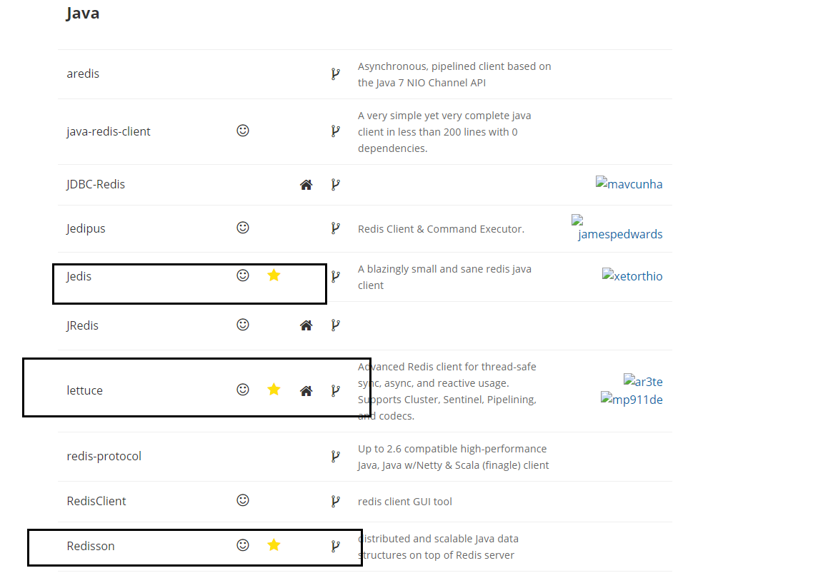

推荐使用的是Jedis和Redisson。常用Jedis。

开始在Java中使用Redis前，要确认已经安装了Redis服务和Java redis驱动。

### 1.新建项目安装依赖

[Maven中依赖包](https://mvnrepository.com/artifact/redis.clients/jedis/3.2.0)  最新版

```xml
<!-- https://mvnrepository.com/artifact/redis.clients/jedis -->
<dependency>
    <groupId>redis.clients</groupId>
    <artifactId>jedis</artifactId>
    <version>3.2.0</version>
</dependency>
```

### 2.简单的测试代码：

```java
 	@Test
    public void demo1(){
        //连接redis数据库
        Jedis jedis =new Jedis("49.234.125.145",6379);
        //权限认证
        jedis.auth("zhn");
        //检查是否连接成功
        System.out.println(jedis.ping());
    }
```

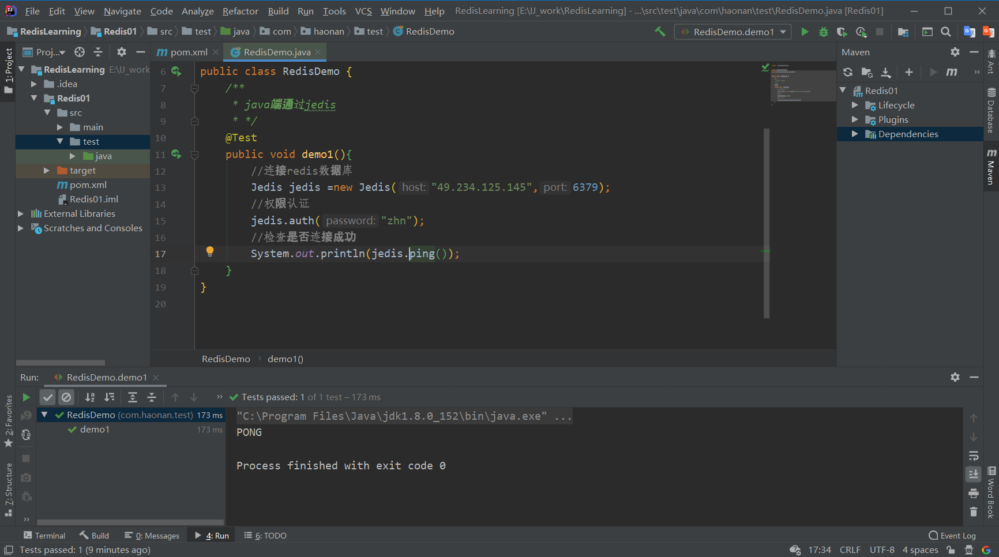

### 3.防火墙设置

> 如果在2中遇到了错误，连接失败，很有可能是未开启服务端的端口防火墙

- 查看已经开放的端口

```shell
firewall-cmd --list-ports
```

- 开启端口

```shell
firewall-cmd --zone=public --add-port=6379/tcp --permanent
```

- 重启防火墙

```sh
firewall-cmd --reload
```

如果上面的命令不好使，会提示安装firewalld

```shell
apt install firewalld
```

第一个命令不知道为啥不显示，又找了俩个命令

```shell
netstat -nupl   //UDP类型的端口
netstat -ntpl   //TCP类型的端口
```

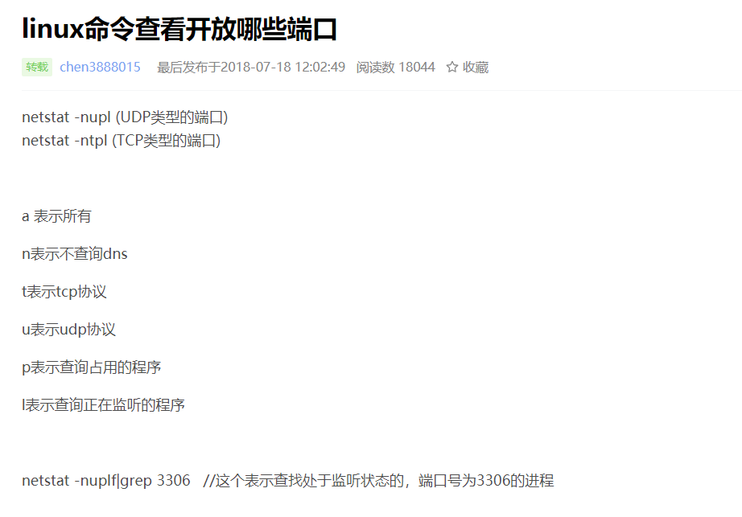

### 4.String测试

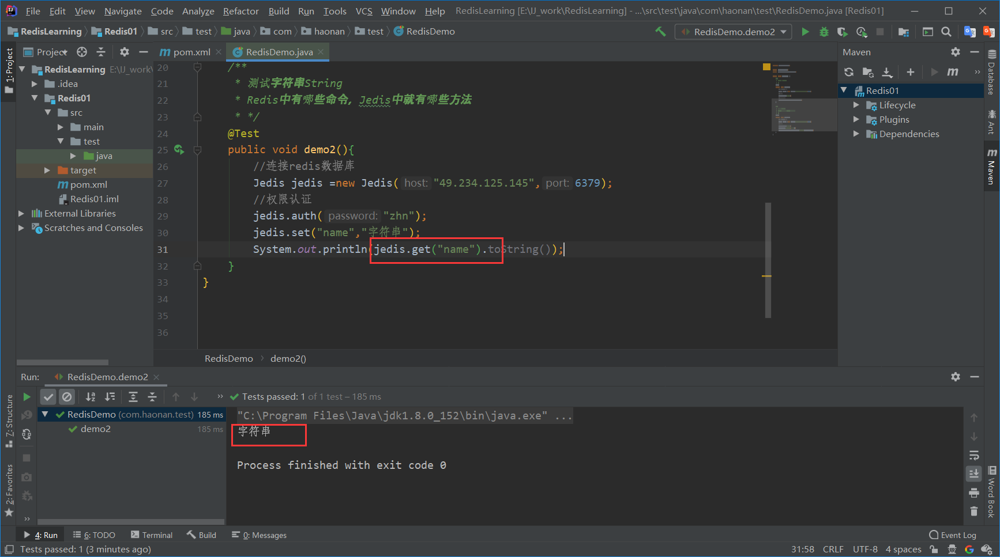

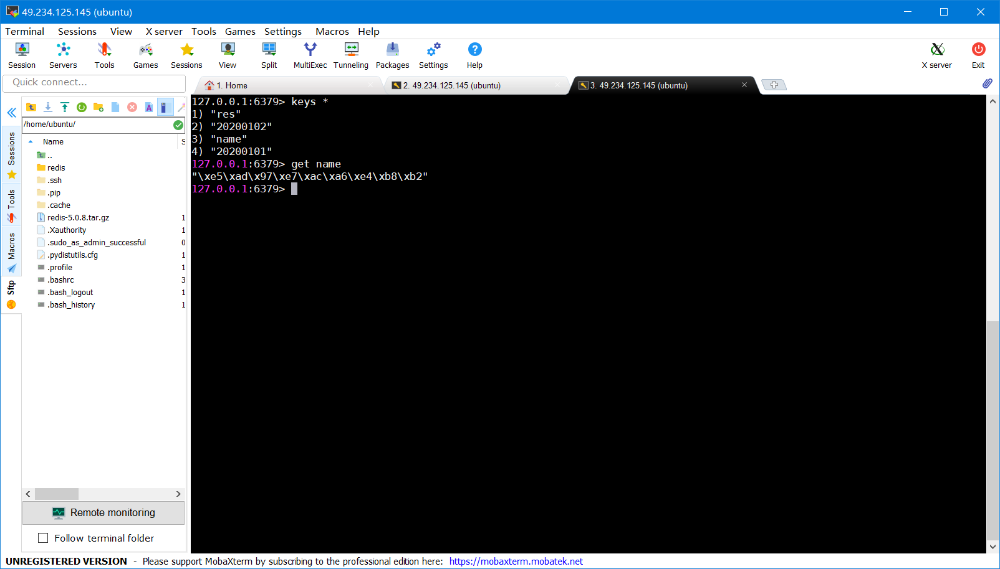

发现：在IDEA中能够正常显示“字符串”这几个汉字，但是在终端下不能，这只是后者这个客户端的不能解码而已，前文也提到过.

```java
@Test
public void demo2(){
    //连接redis数据库
    Jedis jedis =new Jedis("49.234.125.145",6379);
    //权限认证
    jedis.auth("zhn");
    jedis.set("name","字符串");
    System.out.println(jedis.get("name").toString());
    jedis.close();

}
```

测试二：

```java
@Test 
public void demo3(){
    Jedis jedis =new Jedis("49.234.125.145",6379);
    jedis.auth("zhn");
    String key ="newname";
    if(jedis.exists(key)){
        String value =jedis.get(key);
        System.out.println("从Redis数据库中查找得到"+value);
    }
    else {
        String value ="爱谁谁";
        jedis.set(key,value);
        System.out.println("mysql中查询得到并写入Redis中！");
    }
    jedis.close();
}
```

有时候会报这个错误：

MISCONF Redis is configured to save RDB snapshots, but it is currently not able to persist on disk. Commands that may modify the data set are disabled, because this instance is configured to report errors during writes if RDB snapshotting fails (stop-writes-on-bgsave-error option). Please check the Redis logs for details about the RDB error.

MISCONF Redis配置为保存RDB快照，但当前无法持久保存在磁盘上。禁用了可能修改数据集的命令，因为此实例配置为在RDB快照失败时在写入过程中报告错误（stop-writes-on-bgsave-error选项）。请检查Redis日志以获取有关RDB错误的详细信息。

解决方法：修改配置

- 命令行修改方式示例：

```shell
127.0.0.1:6379> config set stop-writes-on-bgsave-error no
```

- 修改redis.conf文件：vi打开redis-server配置的redis.conf文件，然后使用快捷匹配模式：/stop-writes-on-bgsave-error定位到stop-writes-on-bgsave-error字符串所在位置，接着把后面的yes设置为no即可。

### 5.Redis 连接池

将创建连接池和连接的方法写在工具类中。

```java
package com.haonan.utils;
import redis.clients.jedis.Jedis;
import redis.clients.jedis.JedisPool;
import redis.clients.jedis.JedisPoolConfig;

public class MyTool {
    private static JedisPool pool;
    static {
        //连接池Redis Pool基本配置信息
        JedisPoolConfig poolConfig=new JedisPoolConfig();
        poolConfig.setMaxTotal(5);//最大连接数
        poolConfig.setMaxIdle(3);//最大空闲数
        /*…………………………………………*/

        //获得连接池pool
        String host = "49.234.125.145";
        int port=6379;
        pool = new JedisPool(poolConfig,host,port);

    }

    /**
     * 获得jedis连接
     * */
    public static Jedis getJedis(){
        Jedis jedis=pool.getResource();
        jedis.auth("zhn");
        return jedis;
    }
    /**
     * 关闭jedis连接
     * */
    public static void close(Jedis jedis){
        jedis.close();
    }
}
```

```java
@Test
public void demo4(){
    Jedis jedis = MyTool.getJedis();
    System.out.println(jedis.ping().toString());
    MyTool.close(jedis);
}
```

### 6.Hash测试

```java
@Test
public void demo5(){
    /**
     * Jedis完成对Hash类型的操作
     * */
    Jedis jedis = MyTool.getJedis();
    String key = "user";
    if(jedis.exists(key)){
        System.out.println(jedis.hgetAll(key).toString());
        Map<String, String> map = jedis.hgetAll(key);
        System.out.println(map.get("id")+"\t"
                +map.get("name")+"\t"+map.get("age"));
    }
    else {
        jedis.hset(key,"id","1");
        jedis.hset(key,"name","浩男");
        jedis.hset(key,"age","22");
    }
    MyTool.close(jedis);
}
```

## 九、RedisTemplate摸板

### 1.简介

> Spring封装了一个比较强大的模板，也就是redisTemplate，方便在开发的时候操作Redis缓存。它封装了redis连接池管理的逻辑，业务代码无需关心获取，释放连接逻辑；SpringRedis同时支持了Jedis，Jredis。rjc客户端操作。[云社区](https://cloud.tencent.com/developer/article/1349738)

**RedisTemplate在Spring代码中的结构如下**

```java
org.springframework.data.redis.core
Class RedisTemplate<K,V>
java.lang.Object
    org.springframework.data.redis.core.RedisAccessor
        org.springframework.data.redis.core.RedisTemplate<K,V>
```

Type Parameters:

 K

- the Redis key type against which the template works (usually a String) 模板中的Redis key的类型（通常为String）如：RedisTemplate<String, Object> 注意：**如果没特殊情况，切勿定义成RedisTemplate<Object,Object>**，否则根据里氏替换原则，使用的时候会造成类型错误 。

V

- the Redis value type against which the template works 模板中的Redis value的类型

**RedisTemplate中定义了对5种数据结构操作**

```javascript
redisTemplate.opsForValue();//操作字符串
redisTemplate.opsForHash();//操作hash
redisTemplate.opsForList();//操作list
redisTemplate.opsForSet();//操作set
redisTemplate.opsForZSet();//操作有序set
```

### 2.Sprinigdata使用RedisTemplate模板

1、jar：Redis和Spring整合  [Maven仓库](https://mvnrepository.com/artifact/org.springframework.data/spring-data-redis/2.2.6.RELEASE)

```xml
<!-- https://mvnrepository.com/artifact/org.springframework.data/spring-data-redis -->
<dependency>
    <groupId>org.springframework.data</groupId>
    <artifactId>spring-data-redis</artifactId>
    <version>2.2.6.RELEASE</version>
</dependency>
```

在已添加jedis依赖的基础上加上这个依赖。

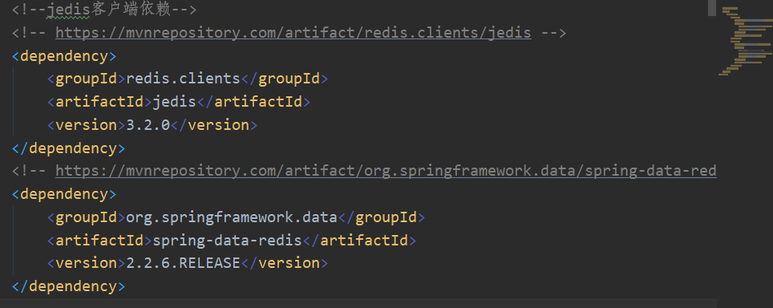

2.实体类User的序列化操作

```java
import java.io.Serializable;
public class User implements Serializable {}
```

这里先不学了，需要用到Spring的知识。

## 十、redis的发布订阅

### 1.简介

> Redis 发布订阅(pub/sub)是一种消息通道模式：发送者pub发送消息，订阅者sub接受消息。Redis 客户端可以订阅任意数量的频道。

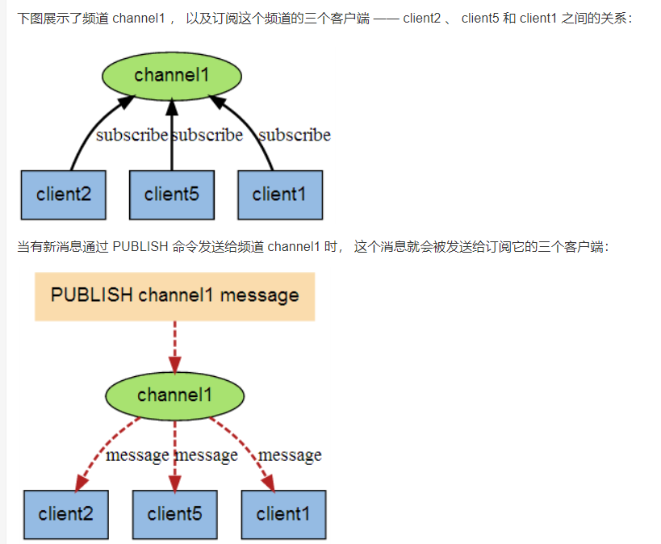

### 2.发布订阅命令

| 序号 | 命令及描述                                                   |
| :--- | :----------------------------------------------------------- |
| 1    | [PSUBSCRIBE pattern [pattern ...]](https://www.runoob.com/redis/pub-sub-psubscribe.html)  订阅一个或多个符合给定模式的频道。 |
| 2    | [PUBSUB subcommand [argument [argument ...\]]](https://www.runoob.com/redis/pub-sub-pubsub.html)  查看订阅与发布系统状态。 |
| 3    | [PUBLISH channel message](https://www.runoob.com/redis/pub-sub-publish.html)  将信息发送到指定的频道。 |
| 4    | [PUNSUBSCRIBE [pattern [pattern ...\]]](https://www.runoob.com/redis/pub-sub-punsubscribe.html)  退订所有给定模式的频道。 |
| 5    | [SUBSCRIBE channel [channel ...]](https://www.runoob.com/redis/pub-sub-subscribe.html)  订阅给定的一个或多个频道的信息。 |
| 6    | [UNSUBSCRIBE [channel [channel ...\]]](https://www.runoob.com/redis/pub-sub-unsubscribe.html)  指退订给定的频道。 |

一个客户端开一个频道：


另一个客户端下publish：


收到：
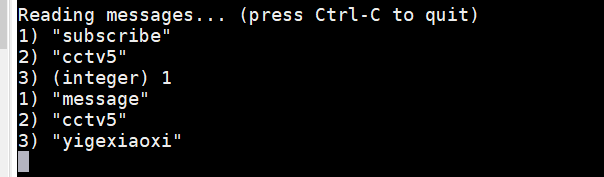

### 3.应用场景

- 构建实时消息系统
- 博客文章推送
- 微信公众号

十一、Redis多数据库

